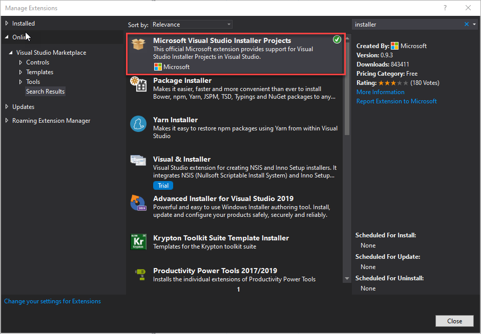

# Get the UNC path from a network drive via application which is in the Windows shell context menu

## Basic informations
- Windows Forms App (.NET Framework)

## Integrated development environment (IDE)
- Microsoft Visual Studio Community 2019

## Requirementes 
- .NET Framework 4.7.2

## Description
##### 0. Setup a new "Windows Forms App"-project
##### 1. Create Setup-Project to add entries to Windows Registry
Add a setup project to the solution:
- Add → New project → Setup Project (Visual Studio Installer)

It could be that you have to install an extension:
- Please click → Extensions and install the Extension "Microsoft Visual Studio Installer Projects".

Add a primary output of your main application to the setup project:
- Right click on the "Setup Project" in the solution explorer and Add → Project output
- Select the project from combo box and "Primary output" from list box
Add keys to the registry:
- Right click on the "Setup Project" in the solution explorer and View → Registry

Add the following keys and values in the setup registry editor window:
- Right click on HKEY_CLASSES_ROOT → New Key → Set the name to "Directory"
- Right click on "Directory" → New → Key → Set the name to "shell"
- Right click on "shell" → New → Key → Set the name to "Get_UNC_Path"
- Right click on "Get_UNC_Path" → New → String Value
  - Delete the name and press Enter
  - Set value to "Get UNC Path" (Name which is shown in the context menu) in the properties window
- Right click on "Get_UNC_Path" → New →  String Value (Set the name to Icon)
  - Set the name to "Icon"
  - Set the value to "[TARGETDIR]windows-unc-path.exe" (name of the exe file)
- Right click on "Get_UNC_Path" → New → Key → Set the name to "command"
- Right click on "command" → New → String Value 
  - Delete the name and press Enter
  -	Set the value to “[TARGETDIR]windows-unc-path.exe” “%V"
